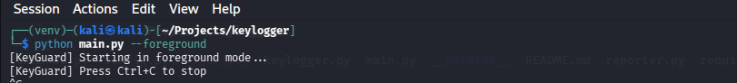
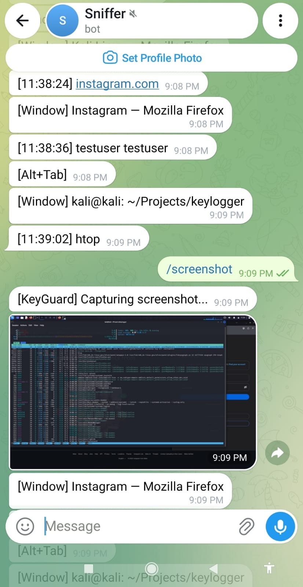
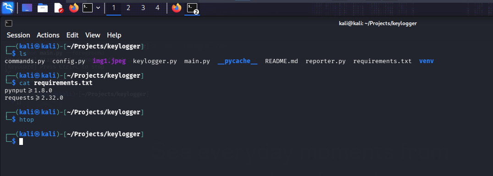

# KeyGuard - Laptop Security Monitor


**Hardik Prajapati — Security Researcher**

A real-time keystroke monitor with Telegram alerting, built as a college security project. Demonstrates keylogging techniques, daemon process management, and Telegram Bot API integration.

> **⚠️ Ethical Use Only**
> This tool is for **educational purposes** and **authorized security testing only**.
> Only use on devices you own or have explicit written permission to monitor.
> Unauthorized use violates privacy laws and is illegal in most jurisdictions.

## Features

- **Global key capture** — captures all keystrokes system-wide via `pynput` (X11 backend)
- **Smart buffering** — accumulates keystrokes into full words, sends on Enter or 3s inactivity
- **Modifier detection** — detects Ctrl, Alt, Shift combos (`[Ctrl+C]`, `[Alt+Tab]`)
- **Window tracking** — automatically detects active window changes
- **Real-time Telegram reporting** — each keystroke/buffer flush sent instantly to your Telegram
- **Timestamped messages** — every message includes `[HH:MM:SS]` timestamp
- **Two execution modes** — foreground (visible terminal) and background (daemon)
- **Telegram commands** — control via `/status`, `/screenshot`, `/stop` from your phone

## Prerequisites

- **Linux** with **X11** display server (run `echo $XDG_SESSION_TYPE` to verify)
- **Python 3.8+**
- **xdotool** — window title detection (`apt install xdotool`)
- **ImageMagick** — screenshot capture (`apt install imagemagick`)

## Quick Start

### 1. Install system dependencies

```bash
sudo apt install xdotool imagemagick
```

### 2. Setup project

```bash
cd keyguard
python3 -m venv venv
source venv/bin/activate
pip install pynput requests
```

### 3. Create a Telegram bot

1. Open Telegram → search for **[@BotFather](https://t.me/BotFather)**
2. Send `/newbot` → choose a name (e.g., `Sniffer`) → get your **bot token**
3. Search for your bot on Telegram → press **Start**
4. Get your **chat ID**:

```bash
# Replace with your token
curl "https://api.telegram.org/bot<YOUR_BOT_TOKEN>/getUpdates"
```

Look for `"chat":{"id":123456789}` in the response.

### 4. Configure

Edit `config.py`:

```python
BOT_TOKEN = "123456789:ABCdef123GhIjklMNOpqrsTUVwxyz"
CHAT_ID = "123456789"
```

### 5. Run

```bash
source venv/bin/activate

# Test in foreground
python main.py --foreground

# Run as daemon
python main.py --background

# Check status
python main.py --status

# Stop daemon
python main.py --stop
```



## Usage

### CLI Options

| Option | Description |
|---|---|
| `--foreground` | Run in visible terminal mode (Ctrl+C to stop) |
| `--background` | Run as background daemon |
| `--status` | Check if daemon is running |
| `--stop` | Stop the background daemon |

### Telegram Commands

Send these to your bot on Telegram:

| Command | Action |
|---|---|
| `/status` | Show uptime, keys captured, active window |
| `/screenshot` | Capture the screen and send the image |
| `/stop` | Gracefully stop KeyGuard |
| `/help` | List available commands |

### Example Telegram Output



The Telegram bot displays window changes, timestamped keystrokes, modifier combos, and responds to commands like `/screenshot`.


Active window tracking automatically detects when you switch between apps — Instagram, terminal, browser, or code editor.



Control KeyGuard remotely via `/status`, `/screenshot`, `/stop`, and `/help` commands from your phone.

```
[Window] Firefox — Instagram
[10:58:32] hello from instagram
[10:59:01] my name is john
[Ctrl+C]
[10:59:05] testing world
[Window] Code — main.py
[11:00:12] def new_feature():
```

## Architecture

```
Keystroke → pynput.Listener → queue.Queue → Reporter thread → Telegram API
                                                   ↑
                                            Window tracker
                                                   ↑
                                            Command listener (polling)
```

- **keylogger.py** — captures global keystrokes via `pynput`, detects modifier combos, queues formatted keys
- **reporter.py** — worker thread with text buffer, flushes on Enter/3s-inactivity/overflow, tracks window titles
- **commands.py** — long-polls Telegram `getUpdates` for `/status`, `/screenshot`, `/stop` commands
- **main.py** — CLI entry point with foreground/background mode, daemonization, signal handling

## Project Structure

```
keyguard/
├── main.py              # CLI entry point
├── keylogger.py         # Key capture engine
├── reporter.py          # Telegram reporter + buffer
├── commands.py          # Telegram command listener
├── config.py            # Bot token & chat ID
├── requirements.txt     # Python dependencies
├── .gitignore
├── images/
│   ├── img1.jpeg        # Telegram chat output
│   ├── img2.jpeg        # Monitored apps overview
│   ├── insta.png        # Instagram tracking demo
│   ├── commands.png     # Telegram commands
│   └── run.png          # Foreground mode execution
└── README.md
```

## License

MIT — for educational use only.
